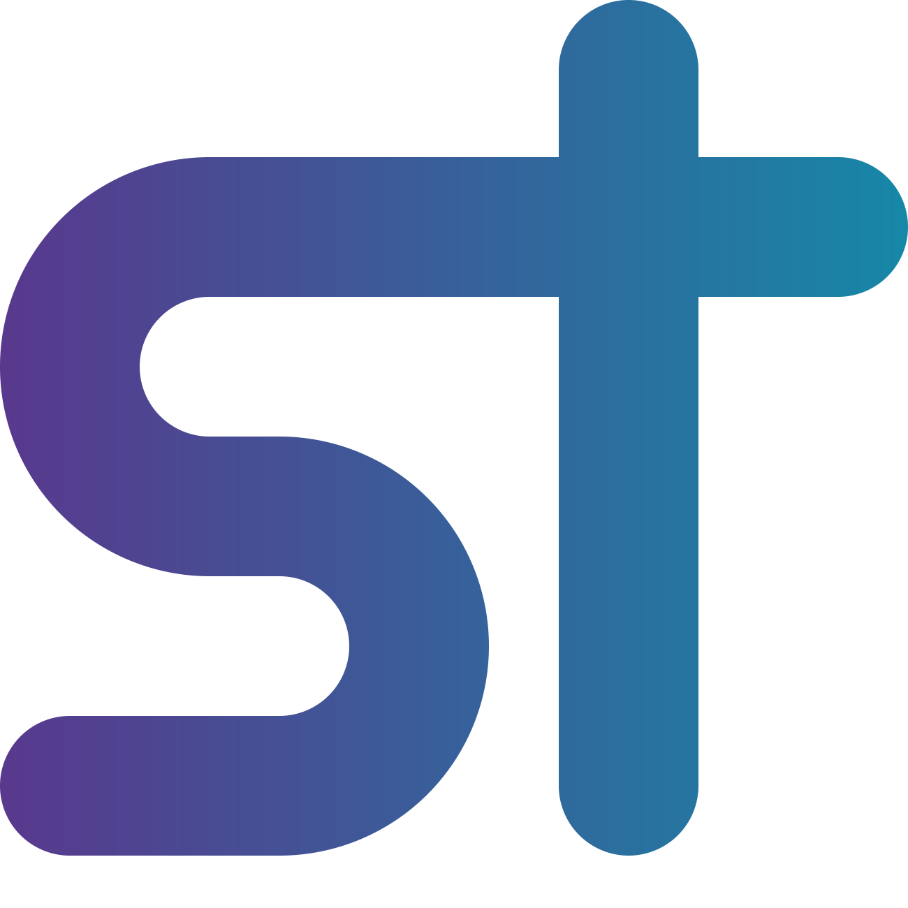

<p align="center">
  <a href="https://shorttech.de">
    
  </a>
</p>
<h1 align="center">
  ingenious-gatsby
</h1>

<h3 align="center">
  👾
</h3>

<p align="center">
  The ShortTech project is sunset. ingenious-gatsby is unmaintained and will thus be released to the general public under MIT license. We hope you can learn from us, as much as we learned from open-source.
 </p>
 
<p align="center">
  ingenious-gatsby is the GatsbyJS and GraphQL-powered frontend that powers ShortTech. The site is generated and compiled by <a href="https://www.gatsbyjs.com/">Gatsby Cloud</a> and then served by <a href="https://netlify.com">Netlify</a>. On the backend site, ShortTech is powered by a headless <a href="https://ghost.org">Ghost</a> installation, which uses our <a href="https://github.com/shorttechde/headless-placeholder">headless-placeholder</a> theme to fix some bugs with e.g. Twitter cards, when the site is set to private.
</p>
<p align="center">
  <a href="https://app.netlify.com/sites/shorttech/deploys">
    
  </a>
  <a href="https://twitter.com/ShortTechDE">
    
  </a>
  <a href="https://github.com/ShortTechDE/ingenious-gatsby/stargazers">
    
  </a>  
</p>

## 🚀 Setup development environment
ingenious-gatsby is using `yarn` to manage its dependencies, as it is the recommended package manager for Ghost. 
```
npm install -g yarn
````

Clone the GitHub repository with `git clone`.
```
git clone https://github.com/ShortTechDE/ingenious-gatsby.git
cd ingenious-gatsby
```

Install the dependencies with `yarn`.
```
yarn
```

Start the development server. You now have a local frontend set up pulling content from our backend.
```
yarn dev
```
## 🤝 Contributing
ingenious-gatsby uses [gitmoji](https://gitmoji.carloscuesta.me/) for all commit messages:

Gitmoji is an initiative to standardize and explain the use of emojis on GitHub commit messages. Using emojis on commit messages provides an easy way of identifying the purpose or intention of a commit.

## 👥 Credits
Thanks to all direct and indirect contributors! ❤️

### 💬 Honorable mentions
- [Tobias Möritz](https://github.com/tobimori)
- [Thilo Billerbeck](https://github.com/thilobillerbeck)
- [Florentin Walter](https://github.com/florentinw)

### ✏️ Other credits
Parts of this frontend have been copied from and customized based on [Ghost](https://ghost.org/)'s own [gatsby-starter-ghost](https://github.com/TryGhost/gatsby-starter-ghost/), [gatsby-theme-try-ghost](https://github.com/styxlab/gatsby-theme-try-ghost/) by [styxlab](https://github.com/styxlab/) and [gatsby-starter-infinite-scroll](https://github.com/baobabKoodaa/gatsby-starter-infinite-scroll/) by [Atte Juvonen](https://github.com/baobabKoodaa/). Be sure to check out their works If you want to start through with a Gatsby-based Ghost blog and/or theme.

## 📄 License
**Copyright (c) 2016 - 2022, ShortTech/Tobias Möritz**

Licensed under the [MIT license](./LICENSE) as of Feb 2022.
